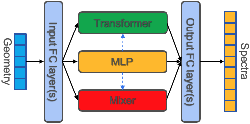
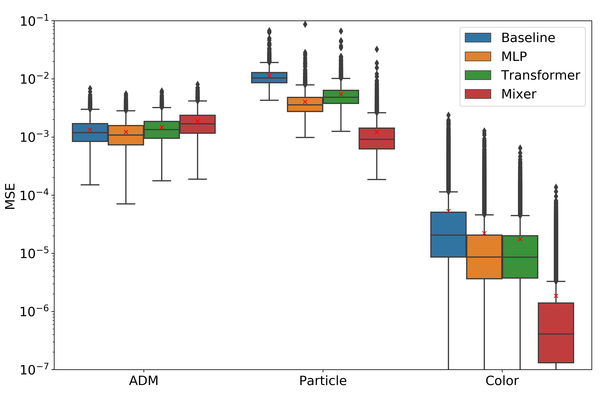
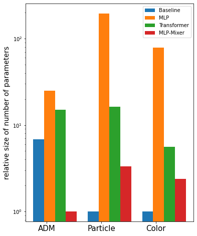

# Benchmarking AEM problems with various DL structures 
[](https://badge.fury.io/py/pypi)
[](https://github.com/Naereen/StrapDown.js/blob/master/LICENSE)


This repository stores implemention of paper [Benchmarking Data-driven Surrogate Simulators for Artificial Electromagnetic Materials]() 

It includes a suit of AEM data set benchmarks along with implementation of various ready-to-use deep learning architectures (MLP, Transformer, MLP-Mixer) for scientific computation problem and a handful of utility functions.

## Data Sets

Schematics of geometry in three physical problems. (a) Infinite array of all-dielectric metasurfaces consists of four elliptical-resonators supercells. (b) A nanophotonic particle consists of four layers. (c) The three-layers color filter design.

## Requirements
| Package | Version |
|:---------------------------------------------:|:------------------------------------------------------------------:|
| Python | \>=3.7 |
| Pytorch | \>= 1.3.1 |
| Numpy  | \>=1.17.4 |
| Pandas | \>=0.25.3 |
| Tensorboard | \>=2.0.0 |
| Tqdm| \>=4.42.0 |
| Sklearn | \>=0.22.1|
| Matplotlib | \>= 3.1.3|
| einops | \>= 0.3.0|
| seaborn | \>= 0.11.2|


## Features 
* Access to various ADM data sets 
* **Off-the-shelf implementation** of MLP, Transformer and MLP-Mixer with high individuality
* Utilities for **data preprocessing and preparation** for downstream deep learning tasks
* Utilities for **plotting** and easy analysis of results


## Usage

### Access to Data Sets
1. ADM Data Set. Please download and unzip from the [Repository](https://doi.org/10.7924/r4jm2bv29).
2. Particle Data Set. Please download and unzip from the [Repository](https://doi.org/10.7924/r4jm2bv29).
3. Color Data Set. Please download and unzip from the [Repository](http://dx.doi.org/10.5258/SOTON/D1686).

### Download Pre-trained Models 
1. MLP: Please download and unzip from the [folder](https://drive.google.com/drive/folders/1Br13vFIqvh-5Kpl7AeHH8CkTbkF2Bufa?usp=sharing).
2. Transformer: Please download and unzip from the [folder](https://drive.google.com/drive/folders/1Br13vFIqvh-5Kpl7AeHH8CkTbkF2Bufa?usp=sharing).
3. MLP-Mixer: Please download and unzip from the [folder](https://drive.google.com/drive/folders/1Br13vFIqvh-5Kpl7AeHH8CkTbkF2Bufa?usp=sharing).

### Install Package
```
pip install AEML
```

### Loading data and Splitting
#### Loading benchmark datasets described in Section 4.1 of the paper

ADM refers to the All-dielectric metasurface dataset. Particle dataset refers to the Nanophotonic Particle dataset. The Color dataset refers to the Color filter dataset. The specification of each dataset is provided in the table below:

| Dataset                    | D_in | D_out | Sub_area          | Simulations | Simulation CPU time  |
|----------------------------|------|-------|-------------------|-------------|-----------|
|  All-dielectric metasurfac | 14   | 2001  | Metamaterials     | 60,000      | 7 months  |
| Nanophotonic particle      | 8    | 201   | Nanophotonics     | 50,000      | 11 hours |
| Color                      | 3    | 3     | Optical waveguide | 100,000     | -         |


#### Loading your own benchmark dataset into the framework
Although we used AEM dataset for benchmarking, this suite is open and easily adaptable to a wide range of applications in the scientific computing community. To test your own custom dataset, simply normalize (or not, your choice, our loader would not normalize your dataset) and put your dataset into the Custom folder with the format: data_x.csv, data_y.csv where each file contains the input and output of the application. The shape should be [#Simulations, Dim_x] and [#Simulations, Dim_y] and separated by comma. Note that there should not be any header in the csv.

```
import AEML
from AEML.data import ADM, Particle, Color, load_custom_dataset

# Load our pre-defined dataset
train_loader, test_loader, test_x, test_y =ADM/Particle/Color(normalize=True/False, batch_size=1024)    # Loading the ADM dataset

# Or, load prepare your own dataset here
# train_loader, test_loader, test_x, test_y = load_custom_dataset()
```


### Loading Models with configurable hyper-paramters and making prediction

#### Architectures of various DL structures implementd
<p align="center">
  
</p>

As dscribed in section 5 in the paper, the architectures are modified slightly from the original Mixer and Transformer models to fit our scientific computing background. 

#### Model hyper-parameter adjustment

```
from AEML.models.Mixer import DukeMIXER
from AEML.models.MLP import DukeMLP
from AEML.models.Transformer import DukeTransformer

# 1. Defining all the models here (We highly recommend training the models one by one due to GPU RAM constraints
#MLP:
model = DukeMLP(dim_g=3, dim_s=3, linear=[500, 500, 500, 500, 500, 500], skip_connection=False, skip_head=0, dropout=0, model_name=None)

#Transformer:
model= DukeTransformer(dim_g, dim_s, feature_channel_num=32, nhead_encoder=8, 
                        dim_fc_encoder=64, num_encoder_layer=6, head_linear=None, 
                        tail_linear=None, sequence_length=8, model_name=None, 
                        ckpt_dir=os.path.join(os.path.abspath(''), 'models','Transformer'))
#Mixer:
model = DukeMIXER(dim_g, dim_s, mlp_dim=500, patch_size=10, mixer_layer_num=6,
                embed_dim=128, token_dim=128, channel_dim=256, 
                mlp_layer_num_front=3, mlp_layer_num_back=3)

# 2. Model training code

#MLP:
model.train_(train_loader, test_loader, epochs=500, optm='Adam', weight_decay=1e-4,
            lr=1e-4, lr_scheduler_name='reduce_plateau', lr_decay_rate=0.2, eval_step=10,
            stop_threshold=1e-7)

#Transformer:
model.train_(train_loader, test_loader, epochs=500, optm='Adam', reg_scale=5e-4, lr=1e-3, 
                        lr_schedueler_name='reduce_plateau',lr_decay_rate=0.3, eval_step=10)

#Mixer:
model.train_(train_loader, test_loader, epochs=500, optm='Adam', weight_decay=1e-4,
            lr=1e-4, lr_scheduler_name='reduce_plateau', lr_decay_rate=0.2, eval_step=10,
            stop_threshold=1e-7)

# Loading the model you just trained or hypersweeped or our provided pretrained model if 
# you don't want to train it or just want to reproduce our result, only choose one between these 2
model.load_model(pre_trained_model='Particle'\'AMD'\'Color'\None, 
                model_directory='YOUR_MODEL_DIRECOTRY')

# Model inference code: Give it X, output Y
pred_Y = model(test_X)

# Model evaluation code: Give it test_X, test_Y, output MSE and generate a plot of MSE histogram in \data
MSE = model.evaluate(test_x, test_y, save_output=False, save_dir='data/')

```


### Performance of various DL structures on benchmark ADM data sets
<p align="center">

</p>

### Relative size of our pre-trained networks
<p align="center">

</p>


## Support

Please file an issue [here](https://github.com/ydeng-MLM/ML_MM_Benchmark/issues).

## License

The project is licensed under the [MIT license](https://github.com/ydeng-MLM/ML_MM_Benchmark/blob/main/LICENSE).

Please cite this work if some of the code or datasets are helpful in your scientific endeavours. For specific datasets, please also cite the respective original source(s), given in the preprint.
